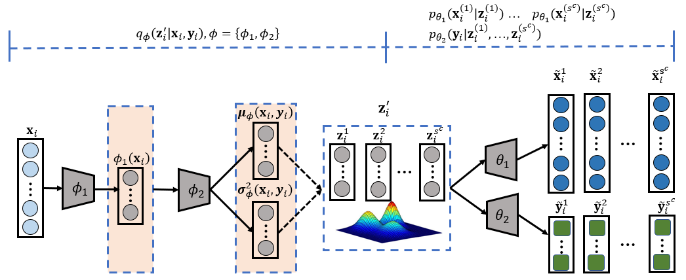

# Deep Generative Mixture Model for Robust Imbalance Classification

This is the official implementation of *DGCMM*.

> Discovering hidden pattern from imbalanced data is a critical issue in various real-world
> applications. The existing classification methods usually suffer from the limitation
> of data especially the minority classes, and result in unstable prediction and low
> performance. In this paper, a deep generative classifier is proposed to mitigate this
> issue via both data perturbation and model perturbation. Specially, the proposed
> generative classifier is  derived from a deep latent variable model where the latent
> variable is represented by a probability distribution to enforce the uncertainty of
> model and lead to stable predictions. Furthermore, the data generative procedure is
> modeled with a Gaussian Mixture Model, which  aims to capture discriminative latent
> distribution and implement data perturbation. Extensive experiments have been conducted
> on widely-used real imbalanced image datasets. By comparing with the popular imbalanced
> classification baselines, experimental results demonstrate the superiority of our
> proposed model on imbalance classification task.



## Requirement

The code was tested on:

- pytorch=1.7.1
- torchvision=0.7.0

To install requirements:

```shell
pip install -r requirements.txt
```
## Usage
In this repo, we provide source code and parameters for `ChestXray` dataset for verification, 
full version will be released upon the acceptance.

To train the model in the paper, run this command:
```shell
python train.py ${DATASET} \
--datadir=./datasets/${DATASET} \
--logdir=./logs/${DATASET}/${TAG} \
--arch=resnet_vae3 \
--epoch=100 \
--batch-size=180 \
--lr=5e-3 \
--wd=1e-4 \
--worker=8 \
--T-max=20 \
--h-dim=2048 \
--z-dim=2048 \
--ngpus=${NGPUS} \
--dist-url="tcp://127.0.0.1:53419" \
--dist-backend="nccl" \
--multiprocessing-distributed \
--world-size=1 \
--rank=0 \
--weight-cls=10 \
--weight-reconst=0.1 \
--weight-gmm=0.001 \
--pretrained
```
The dataset will be automatically downloaded and prepared in `./datasets` when first run.

We provided two augmentation strategies, for long-tailed datasets, the proposed DGCMM uses feature transfer learning technique to generate new instances (Case 1). Otherwise, DGCMM uses posterior probability to sample new latent codes and 
generate new instances (Case 2). 


### Case 1: 
To augment using feature transfer learning

```shell
python augment_ftl.py ${DATASET} \
--datadir=./datasets/${DATASET} \
--logdir=./logs/${DATASET}/${TAG} \
--arch=resnet_vae3 \
--epoch=100 \
--batch-size=100 \
--lr=1e-2 \
--wd=1e-4 \
--print-freq=100 \
--worker=8 \
--gpu=0 \
--lr-step=30 \
--h-dim=2048 \
--z-dim=2048 \
--resume=./logs/${DATASET}/${TAG}/checkpoint.pth
```

Case 2: 
To augment using posterior probability

```shell
python augment.py ${DATASET} \
--datadir=./datasets/${DATASET} \
--logdir=./logs/${DATASET}/${TAG} \
--arch=resnet_vae3 \
--epoch=100 \
--batch-size=100 \
--lr=1e-2 \
--wd=1e-4 \
--print-freq=100 \
--worker=8 \
--gpu=0 \
--lr-step=30 \
--h-dim=2048 \
--z-dim=2048 \
--resume=./logs/${DATASET}/${TAG}/checkpoint.pth
```


Run `python train.py -h` to see the full help message:
```
python train.py -h            
usage: train.py [-h] [-a ARCH] [-j N] [--epochs N] [--start-epoch N] [-b N]
                [--lr LR] [--momentum M] [--wd W] [--step-size STEP_SIZE]
                [-p N] [--resume PATH] [-e] [--pretrained]
                [--world-size WORLD_SIZE] [--rank RANK] [--dist-url DIST_URL]
                [--dist-backend DIST_BACKEND] [--seed SEED] [--gpu GPU]
                [--multiprocessing-distributed] [--new-size NEW_SIZE]
                [--crop-size CROP_SIZE] [--datadir DATADIR] [--logdir LOGDIR]
                [--warmup-threshold WARMUP_THRESHOLD]
                [--warmup-epochs WARMUP_EPOCHS] [--lr-step LR_STEP]
                [--ngpus NGPUS] [--milestones MILESTONES [MILESTONES ...]]
                [--gamma GAMMA] [--clip-grad CLIP_GRAD] [--z-dim Z_DIM]
                [--h-dim H_DIM] [--generative] [--weight-cls WEIGHT_CLS]
                [--weight-reconst WEIGHT_RECONST] [--weight-gmm WEIGHT_GMM]
                DIR

PyTorch Training

positional arguments:
  DIR                   path to datasets

optional arguments:
  -h, --help            show this help message and exit
  -a ARCH, --arch ARCH  model architecture
  -j N, --workers N     number of data loading workers (default: 4)
  --epochs N            number of total epochs to run
  --start-epoch N       manual epoch number (useful on restarts)
  -b N, --batch-size N  mini-batch size (default: 256), this is the total
                        batch size of all GPUs on the current node when using
                        Data Parallel or Distributed Data Parallel
  --lr LR, --learning-rate LR
                        initial learning rate
  --momentum M          momentum
  --wd W, --weight-decay W
                        weight decay (default: 1e-4)
  --step-size STEP_SIZE
  -p N, --print-freq N  print frequency (default: 100)
  --resume PATH         path to latest checkpoint (default: none)
  -e, --evaluate        evaluate model on validation set
  --pretrained          use pre-trained model
  --world-size WORLD_SIZE
                        number of nodes for distributed training
  --rank RANK           node rank for distributed training
  --dist-url DIST_URL   url used to set up distributed training
  --dist-backend DIST_BACKEND
                        distributed backend
  --seed SEED           seed for initializing training.
  --gpu GPU             GPU id to use.
  --multiprocessing-distributed
                        Use multi-processing distributed training to launch N
                        processes per node, which has N GPUs. This is the
                        fastest way to use PyTorch for either single node or
                        multi node data parallel training
  --new-size NEW_SIZE   size of the resized input image
  --crop-size CROP_SIZE
                        size of the croped input image
  --datadir DATADIR     path to the dataset
  --logdir LOGDIR       path to the log directory
  --warmup-threshold WARMUP_THRESHOLD
                        warm up until the loss less than given threshold
  --warmup-epochs WARMUP_EPOCHS
                        warm up epochs
  --lr-step LR_STEP     parameter for StepLR scheduler
  --ngpus NGPUS         number of GPUs to use.
  --milestones MILESTONES [MILESTONES ...]
                        parameter for MultiStepLR scheduler
  --gamma GAMMA         parameter for scheduler
  --clip-grad CLIP_GRAD
                        clip gradient norm
  --z-dim Z_DIM         dimension for z
  --h-dim H_DIM         dimension for latent space
  --generative          whether to use generative classifier
  --weight-cls WEIGHT_CLS
                        loss weight for classification term
  --weight-reconst WEIGHT_RECONST
                        loss weight for reconstruction term
  --weight-gmm WEIGHT_GMM
                        loss weight for GMM term

```